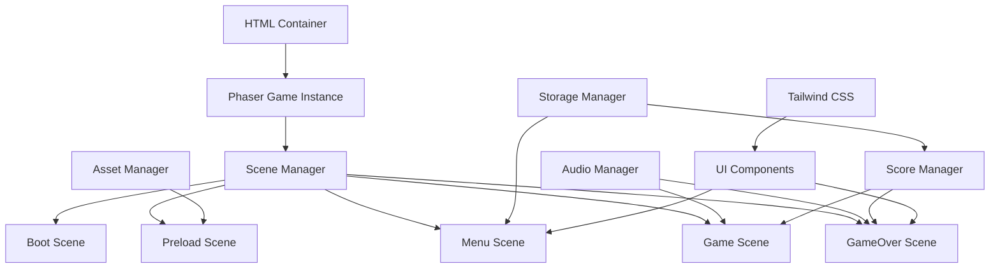
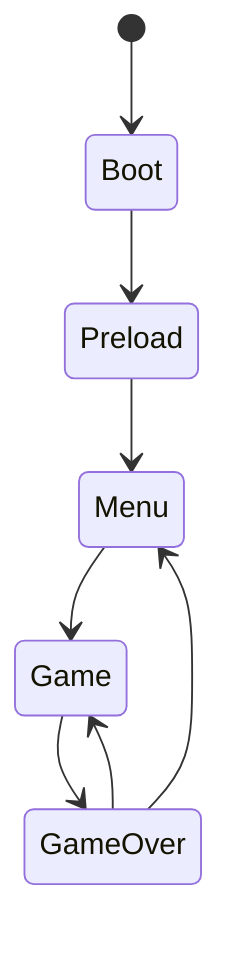

# Design Document

## Overview

Este documento describe el diseño técnico para un clon profesional de Flappy Bird que mejora la implementación existente. El juego utilizará Phaser 3 como motor de juego, TypeScript para tipado estático, Tailwind CSS para UI moderna, y Vite como build tool. El diseño se enfoca en crear una experiencia de usuario pulida con arquitectura modular, rendimiento optimizado, y características adicionales opcionales.

## Architecture

### High-Level Architecture



### Scene Flow



### Core Systems

1. **Scene Management**: Phaser's built-in scene system with custom scene transitions
2. **Physics System**: Phaser Arcade Physics for collision detection and movement
3. **Asset Management**: Centralized loading and caching of sprites, sounds, and fonts
4. **State Management**: Game state persistence using localStorage
5. **Audio System**: Optional sound effects with volume control
6. **UI System**: Hybrid approach using Phaser for game UI and HTML/Tailwind for menus

## Components and Interfaces

### Core Game Components

#### Bird Component
```typescript
interface BirdConfig {
  x: number;
  y: number;
  texture: string;
  jumpForce: number;
  maxRotation: number;
}

class Bird extends Phaser.Physics.Arcade.Sprite {
  private jumpForce: number;
  private maxRotation: number;
  
  jump(): void;
  updateRotation(): void;
  reset(): void;
}
```

#### Pipe System
```typescript
interface PipeConfig {
  speed: number;
  gap: number;
  spawnInterval: number;
  minHeight: number;
  maxHeight: number;
}

class PipeManager {
  private pipes: Phaser.Physics.Arcade.Group;
  private config: PipeConfig;
  
  generatePipe(): void;
  updatePipes(): void;
  checkCollisions(bird: Bird): boolean;
  checkScoring(bird: Bird): boolean;
}
```

#### Score System
```typescript
interface ScoreData {
  current: number;
  high: number;
  session: number;
}

class ScoreManager {
  private scoreData: ScoreData;
  
  increment(): void;
  reset(): void;
  saveHighScore(): void;
  getHighScore(): number;
}
```

### Scene Components

#### Enhanced Menu Scene
```typescript
class MenuScene extends Phaser.Scene {
  private uiContainer: HTMLElement;
  private characterSelector?: CharacterSelector;
  
  createUI(): void;
  createBackground(): void;
  handlePlayButton(): void;
  showHighScore(): void;
}
```

#### Enhanced Game Scene
```typescript
class GameScene extends Phaser.Scene {
  private bird: Bird;
  private pipeManager: PipeManager;
  private scoreManager: ScoreManager;
  private audioManager: AudioManager;
  private background: ParallaxBackground;
  
  setupPhysics(): void;
  setupInput(): void;
  handleGameLoop(): void;
  handleCollisions(): void;
}
```

#### Enhanced GameOver Scene
```typescript
class GameOverScene extends Phaser.Scene {
  private finalScore: number;
  private isNewHighScore: boolean;
  
  displayResults(): void;
  createRestartButton(): void;
  createMenuButton(): void;
  showScoreAnimation(): void;
}
```

### Optional Components

#### Audio Manager
```typescript
interface AudioConfig {
  jump: string;
  score: string;
  hit: string;
  background?: string;
  volume: number;
}

class AudioManager {
  private sounds: Map<string, Phaser.Sound.BaseSound>;
  private volume: number;
  
  playSound(key: string): void;
  setVolume(volume: number): void;
  preloadSounds(): void;
}
```

#### Parallax Background
```typescript
class ParallaxBackground {
  private layers: Phaser.GameObjects.TileSprite[];
  private speeds: number[];
  
  update(): void;
  addLayer(texture: string, speed: number): void;
}
```

#### Character Selector
```typescript
interface Character {
  id: string;
  name: string;
  texture: string;
  unlocked: boolean;
}

class CharacterSelector {
  private characters: Character[];
  private selectedCharacter: string;
  
  selectCharacter(id: string): void;
  getSelectedCharacter(): Character;
  saveSelection(): void;
}
```

## Data Models

### Game Configuration
```typescript
interface GameConfig {
  physics: {
    gravity: number;
    birdJumpForce: number;
    pipeSpeed: number;
  };
  gameplay: {
    pipeGap: number;
    pipeSpawnInterval: number;
    difficultyIncrease: boolean;
  };
  visual: {
    canvasWidth: number;
    canvasHeight: number;
    backgroundColor: string;
  };
  audio: {
    enabled: boolean;
    volume: number;
  };
}
```

### Game State
```typescript
interface GameState {
  currentScore: number;
  highScore: number;
  selectedCharacter: string;
  audioEnabled: boolean;
  audioVolume: number;
  gamesPlayed: number;
}
```

### Asset Manifest
```typescript
interface AssetManifest {
  images: {
    [key: string]: {
      path: string;
      frameWidth?: number;
      frameHeight?: number;
    };
  };
  audio: {
    [key: string]: {
      path: string;
      volume?: number;
    };
  };
  fonts: {
    [key: string]: string;
  };
}
```

## Error Handling

### Error Categories

1. **Asset Loading Errors**
   - Missing texture files
   - Corrupted audio files
   - Network connectivity issues

2. **Runtime Errors**
   - Physics system failures
   - Memory leaks from sprite management
   - LocalStorage access issues

3. **User Input Errors**
   - Invalid touch/click events
   - Keyboard input conflicts

### Error Handling Strategy

```typescript
class ErrorHandler {
  static handleAssetError(error: Error, assetKey: string): void {
    console.warn(`Failed to load asset: ${assetKey}`, error);
    // Fallback to default assets or placeholder
  }
  
  static handleGameplayError(error: Error): void {
    console.error('Gameplay error:', error);
    // Reset game state or show error message
  }
  
  static handleStorageError(error: Error): void {
    console.warn('Storage error:', error);
    // Continue without persistence
  }
}
```

### Graceful Degradation

- **Audio Failure**: Game continues without sound effects
- **Asset Loading Failure**: Use colored rectangles as fallback sprites
- **LocalStorage Failure**: Maintain high score in memory for session only
- **Physics Errors**: Reset game state and restart scene

## Testing Strategy

### Unit Testing Approach

1. **Component Testing**
   - Bird movement and physics
   - Pipe generation and collision detection
   - Score calculation and persistence
   - Audio system functionality

2. **Scene Testing**
   - Scene transitions
   - UI element interactions
   - State management between scenes

3. **Integration Testing**
   - Complete game flow from menu to game over
   - Asset loading and error handling
   - Cross-browser compatibility

### Test Structure

```typescript
// Example test structure
describe('Bird Component', () => {
  let bird: Bird;
  let scene: Phaser.Scene;
  
  beforeEach(() => {
    // Setup test scene and bird
  });
  
  test('should jump when jump() is called', () => {
    // Test jump functionality
  });
  
  test('should rotate based on velocity', () => {
    // Test rotation logic
  });
});

describe('Game Scene', () => {
  test('should handle collision correctly', () => {
    // Test collision detection
  });
  
  test('should increment score when passing pipe', () => {
    // Test scoring logic
  });
});
```

### Performance Testing

1. **Frame Rate Monitoring**: Ensure consistent 60 FPS
2. **Memory Usage**: Monitor sprite creation/destruction
3. **Asset Loading Times**: Optimize preload phase
4. **Mobile Performance**: Test on various device capabilities

### Browser Compatibility Testing

- **Desktop**: Chrome, Firefox, Safari, Edge
- **Mobile**: iOS Safari, Chrome Mobile, Samsung Internet
- **Feature Detection**: WebGL support, Audio API availability
- **Responsive Design**: Various screen sizes and orientations

## Implementation Considerations

### Performance Optimizations

1. **Object Pooling**: Reuse pipe sprites instead of creating/destroying
2. **Texture Atlasing**: Combine small sprites into single texture
3. **Audio Preloading**: Load all sounds during preload phase
4. **Efficient Collision Detection**: Use Phaser's optimized physics system

### Accessibility Features

1. **Keyboard Navigation**: Full keyboard support for menu navigation
2. **Screen Reader Support**: Proper ARIA labels for UI elements
3. **High Contrast Mode**: Alternative color schemes
4. **Reduced Motion**: Option to disable parallax effects

### Mobile Optimizations

1. **Touch Input**: Responsive touch controls
2. **Screen Orientation**: Support both portrait and landscape
3. **Performance Scaling**: Adjust quality based on device capabilities
4. **Battery Optimization**: Efficient rendering and physics calculations

### Responsive Design Integration

```css
/* Tailwind classes for responsive game container */
.game-container {
  @apply w-full max-w-4xl mx-auto;
  @apply aspect-[4/3] md:aspect-[16/10];
  @apply bg-gradient-to-b from-sky-400 to-sky-600;
  @apply rounded-lg shadow-2xl overflow-hidden;
}

.ui-overlay {
  @apply absolute inset-0 pointer-events-none;
  @apply flex flex-col items-center justify-center;
  @apply text-white font-bold text-shadow;
}
```

### Build and Deployment

1. **Asset Optimization**: Compress images and audio files
2. **Code Splitting**: Separate scenes into different chunks
3. **Progressive Loading**: Load assets as needed
4. **CDN Integration**: Serve assets from CDN for better performance

This design provides a solid foundation for implementing a professional Flappy Bird clone that meets all the specified requirements while maintaining good performance, accessibility, and user experience standards.